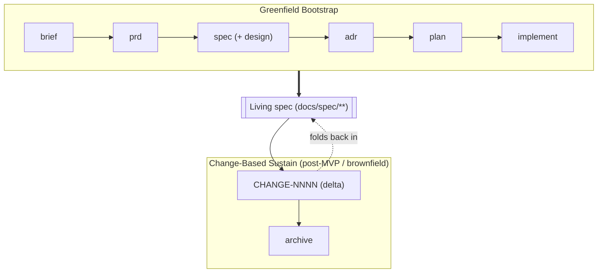

# SDD Starter — Spec-Driven Development Scaffold

> **Principle:** the specification is the single source of truth. Code serves the spec —
> the spec never serves the code.

A ready-to-use, MIT-licensed scaffold for **Spec-Driven Development**: plain Markdown,
no CLI, no runtime, no lock-in. Clone it, declare what you're building, and drive a project
from idea to implementation with every decision traceable and every rule enforced in CI.

## Why This Exists — Control the Ideas, Not the Code

When an LLM can generate more code than you can read, reviewing code line-by-line stops
scaling. The leverage moves **up a level** — to the ideas the code must satisfy: the
brief, the spec, the decisions, the acceptance criteria. That is not the end of software
craftsmanship; it is craftsmanship applied where it now counts. (See antirez,
[_Control the ideas, not the code_](https://antirez.com/news/169).)

This scaffold makes those ideas first-class: **versioned, reviewable, and enforced** with
the same rigor as code — immutable decisions, an amendment process, and CI gates that
block a non-compliant PR rather than trusting an agent to remember the rules. That is what
"Idea as code" means here.

## The Two-Mode Lifecycle



- **Greenfield** builds the initial living spec, phase by phase.
- **Change-based** sustains it: after the spec is accepted you never edit it ad hoc —
  every change is a delta (`ADDED` / `MODIFIED` / `REMOVED`) that folds into the living
  spec and is then archived. Archiving keeps an agent's working context small (it reads
  the active tree, not the history) without losing the audit trail. See
  [`docs/changes/`](./docs/changes/).

## Repository Structure

```
.
├── constitution.md               ← binding principles + their enforcement (read first)
├── SPEC_VERSION.md               ← spec version + amendment log
├── sdd.config.yml                ← capabilities + process (which docs are mandatory)
├── AGENTS.md                     ← operating manual for AI agents
├── docs/
│   ├── product/                  ← brief.md, prd.md
│   ├── spec/                     ← technical-spec.md (SSoT), data-model.md, api-contracts.md
│   ├── design/                   ← design.md (design system) + mockups/
│   ├── adr/                      ← MADR decisions (ADR-0000-template.md) + index
│   ├── plan/                     ← milestones.md, backlog.md (+ archive/)
│   ├── changes/                  ← CHANGE-NNNN deltas (+ archive/)
│   └── ecosystem/                ← OPTIONAL: forge-md interop (delete if unused)
├── prompts/                      ← tool-agnostic prompt body per phase
├── .claude/commands/             ← Claude Code command wrappers over prompts/
├── .github/                      ← PR template + CI (adr-status, spec-lint)
├── scripts/spec-lint.mjs         ← the enforcement backbone
├── src/  tests/                  ← implementation
```

## The Workflow

Each phase has a command (Claude Code: [`.claude/commands/`](./.claude/commands/)) backed
by a tool-agnostic prompt (any agent: [`prompts/`](./prompts/)):

| # | Phase | Command | Output |
|---|-------|---------|--------|
| 1 | Idea | `/brief` | `docs/product/brief.md` |
| 2 | Requirements | `/prd` | `docs/product/prd.md` |
| 3 | Specification | `/spec`, `/design` | `docs/spec/*.md`, `docs/design/design.md` |
| 4 | Decisions | `/adr` | `docs/adr/ADR-NNNN-*.md` |
| 5 | Planning | `/plan` | `docs/plan/milestones.md`, `docs/plan/backlog.md` |
| 6 | Implementation | `/implement TASK-XXX` | `src/`, `tests/` |

Agents draft; humans accept. Every generated document marks inferences
`[INFERRED - CONFIRM]` and gaps `[OPEN - REQUIRES INPUT]` rather than guessing. See
[`AGENTS.md`](./AGENTS.md).

## Getting Started

1. **Clone and rename** this repo.
2. **Declare your project** in [`sdd.config.yml`](./sdd.config.yml) - set `capabilities`
   (`ui` / `api` / `data`) and `process` (`prd` / `milestones`); that decides which docs
   are mandatory.
3. **Read [`constitution.md`](./constitution.md)** — the rules `spec-lint` enforces.
4. **Enable the local hook** (optional): `git config core.hooksPath .githooks`.
5. **Start at `/brief`** (or, for an existing codebase, write a minimal
   `docs/spec/technical-spec.md` of what is already true and drive changes through
   `docs/changes/`).
6. **Work phase by phase** — do not implement ahead of an accepted spec. Every PR fills
   [`.github/PULL_REQUEST_TEMPLATE.md`](./.github/PULL_REQUEST_TEMPLATE.md); the Spec
   Reference is mandatory and CI-enforced.

## Landing Zone for a forge-md Bundle

This scaffold is the downstream half of a pipeline. The
[**forge-md**](https://github.com/Vedoma/forge-md) workbench takes an idea through
collaborative, multi-model spec review and exports a **bundle** that unzips straight into
this structure — phases 1–5 already filled (brief, PRD, spec, decisions, plan). You then
enter at `/implement`. The mapping is described in the optional
[`docs/ecosystem/forge-md.md`](./docs/ecosystem/forge-md.md) (delete it if you never use
forge-md).

Nothing forces you upstream: this scaffold stands alone. Together they are one pipeline —
collaborative spec review + a neutral public scaffold + a plain-Markdown handoff — with
**zero lock-in at every layer**: self-hostable workbench, MIT scaffold, portable Markdown.

## Key Rules

The binding principles live in **[`constitution.md`](./constitution.md)** - each with the
CI/review mechanism that enforces it. In short: the spec is the single source of truth;
spec overreach is a defect; accepted specs are never edited silently (use the
`SPEC_VERSION.md` amendment process); ADRs are immutable (supersede, never overwrite);
tests derive from acceptance criteria; no secrets in the repo; every change is reviewable
and reversible. Read the constitution for the full, enforceable list.

## Choosing What's Mandatory

No team-size tiers. Which documents are required is a real, machine-read setting driven by
two honest axes in [`sdd.config.yml`](./sdd.config.yml): **capabilities** - what the project
is (`ui` → design spec, `api` → api-contracts, `data` → data-model) - and **process** - how
much planning you want (`prd`, `milestones`). The core (brief, technical-spec, backlog) is
always required; `spec-lint` enforces exactly what the config resolves to. A data-less CLI
is never asked for a data model; a solo UI app still gets its design spec. See
[`docs/profiles.md`](./docs/profiles.md) for the model and starting points.

## License

MIT. Use it freely for commercial and open-source projects.
