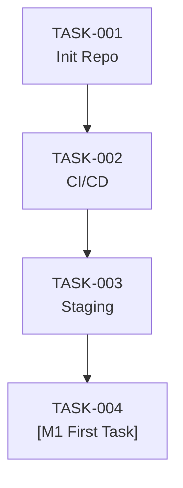

# Implementation Backlog: Gate Verification

<!--
PHASE 5 — IMPLEMENTATION BACKLOG
Instructions: Decompose each milestone into granular tasks.
Each task must be completable in a single focused session (1–4 hours).

Rules:
- Every task MUST have a Spec Reference to the exact spec section it implements
- Every task MUST have 2–5 verifiable acceptance criteria (binary checkboxes)
- Tasks for AI-assisted implementation MUST include "Do Not" constraints
- BLOCKING tasks must be completed before their dependents can start
- Task IDs are sequential and never reused; closed tasks stay in the backlog
-->

**Spec Version:** [x.x] | **Last Updated:** YYYY-MM-DD

---

## Milestone 0 — Foundation

---

### TASK-001: Initialise Repository Structure

| Field | Value |
|-------|-------|
| **Spec Reference** | §1.2 (Tech Stack), §7 (Environment Config) |
| **ADR Reference** | ADR-0001 (if stack choice is decided) |
| **Milestone** | 0 |
| **Priority** | P0 |
| **Effort** | S (< 1 hour) |
| **Blocked By** | — |
| **Assigned To** | [Name / AI] |
| **Status** | To Do |

**Context:**
Set up the canonical folder structure so all subsequent tasks have a consistent home. This task has no feature logic — it is purely structural scaffolding.

**Implementation Instructions:**
1. Create folder structure per `README.md` (src/, tests/, docs/ are already present in this repo)
2. Add language-appropriate `.gitignore`
3. Create `src/` and `tests/` directories with `.gitkeep` placeholders
4. Verify the structure matches `docs/spec/technical-spec.md §1.1`

**Acceptance Criteria:**
- [ ] All folders defined in the spec exist in the repo
- [ ] `.gitignore` excludes build artifacts, secrets files (`.env`), and OS files
- [ ] `README.md` setup instructions are accurate and tested

**Do Not:**
- Add any application code in this task
- Install dependencies in this task (that is TASK-002)

---

### TASK-002: Configure CI/CD Pipeline

| Field | Value |
|-------|-------|
| **Spec Reference** | §1.2 (CI/CD row in tech stack table) |
| **ADR Reference** | — |
| **Milestone** | 0 |
| **Priority** | P0 |
| **Effort** | M (2–3 hours) |
| **Blocked By** | TASK-001 |
| **Assigned To** | [Name] |
| **Status** | To Do |

**Context:**
A passing CI pipeline is the exit criterion for M0. No feature code is merged until this is green on a clean branch.

**Implementation Instructions:**
1. Create `.github/workflows/ci.yml` (or equivalent for your CI provider)
2. Configure jobs: lint → unit tests → integration tests → security scan → build check
3. Ensure the pipeline runs on: push to `main`, all pull requests
4. Configure branch protection: PRs require passing CI before merge

**Acceptance Criteria:**
- [ ] CI pipeline runs automatically on PR creation
- [ ] CI fails if any lint error, test failure, or build error exists
- [ ] CI passes on a clean repository with placeholder tests
- [ ] Branch protection rules are active on `main`
- [ ] Pipeline runtime < 5 minutes on a typical PR

**Do Not:**
- Configure deployment in this task (staging deployment is TASK-003)
- Add environment secrets to the pipeline yet — use placeholder values

---

### TASK-003: Provision Staging Environment

<!-- Copy and fill in TASK-001 block structure for each new task -->

| Field | Value |
|-------|-------|
| **Spec Reference** | §7 (Environment Configuration), §8 (Third-Party Integrations) |
| **ADR Reference** | — |
| **Milestone** | 0 |
| **Priority** | P0 |
| **Effort** | M |
| **Blocked By** | TASK-002 |
| **Assigned To** | [Name] |
| **Status** | To Do |

**Context:**
All integration tests and QA work happens in staging. Staging must mirror production configuration as closely as possible.

**Implementation Instructions:**
1. Provision staging infrastructure per §7 environment variables
2. Configure all third-party services for staging (use test/sandbox credentials)
3. Apply baseline database migration to staging
4. Verify each environment variable in `.env.example` is set in staging
5. Add automated health check endpoint to confirm staging is live

**Acceptance Criteria:**
- [ ] All environment variables from `.env.example` are configured in staging
- [ ] Database migrations run successfully against staging database
- [ ] Health check endpoint (`GET /health`) returns `200 OK` in staging
- [ ] Deployment to staging is triggered automatically on merge to `main`

**Do Not:**
- Use production credentials in staging
- Expose staging to the public internet without auth protection

---

## Milestone 1 — [Name]

<!-- 
Add tasks below following the same TASK-XXX pattern.
Increment task numbers sequentially across all milestones.
-->

---

### TASK-004: Verify the spec-lint gate blocks a non-compliant merge (DO NOT MERGE)

<!--
THROWAWAY VERIFICATION TASK. This deliberately violates constitution C5 — a task must
carry >=2 acceptance criteria — so that spec-lint fails and the required status check
blocks the merge. It also replaces the shipped template block (and the placeholder H1
product name), without which spec-lint would silently skip every task check in this file.
Close this PR without merging and delete the branch.
-->

| Field | Value |
|-------|-------|
| **Spec Reference** | §1.1 (structural — verification only) |
| **ADR Reference** | — |
| **Milestone** | 1 |
| **Priority** | P2 |
| **Effort** | S |
| **Blocked By** | — |
| **Assigned To** | AI |
| **Status** | To Do |

**Context:**
Exists only to prove the merge gate works: `spec-lint` should report an error for this
task and, with branch protection active, GitHub should block the merge rather than merely
annotate it.

**Implementation Instructions:**
1. None — this task is never implemented.

**Acceptance Criteria:**
- [ ] Only one acceptance criterion is present here — this single checkbox is the
  deliberate C5 violation the gate must catch

**Do Not:**
- Merge this PR.

---

## Dependency Graph

<!--
Update this diagram as tasks are added. Blockers must be listed above their dependents.
-->

---

## Backlog Status Summary

| Status | Count |
|--------|-------|
| To Do | 4 |
| In Progress | 0 |
| Done | 0 |
| Blocked | 0 |

<!-- Update this table manually or via a script as task statuses change -->
