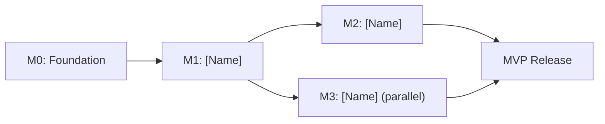

# Milestone Plan: [Product Name]

<!--
PHASE 5 — MILESTONE PLAN
Instructions: Decompose the Technical Specification into phased, deliverable milestones.
Each milestone must have a clear exit criterion — a binary test of completion.

Rules:
- Milestone 0 (Foundation) is always first. No feature work before it is complete.
- Every milestone maps to specific spec sections.
- Milestones are ordered by dependency, not by feature desirability.
- Update this document when milestones are added, split, or re-sequenced (with amendment in SPEC_VERSION.md).
-->

**Spec Version:** [x.x] | **Last Updated:** YYYY-MM-DD  
**Tech Spec Reference:** [docs/spec/technical-spec.md](../spec/technical-spec.md)  
**Total Timeline:** [X weeks]

---

## Milestone Summary Table

| Milestone | Name | Spec Sections | Deliverable | Exit Criteria | Target Date |
|-----------|------|---------------|-------------|---------------|-------------|
| M0 | Foundation | §1.2, §7 | Scaffolded repo, CI/CD, local dev environment | All engineers can run the app locally; CI passes on empty main | YYYY-MM-DD |
| M1 | [Name] | §2.x, §3.x | [What ships] | [Binary test of completion] | YYYY-MM-DD |
| M2 | [Name] | §2.x, §4.x | [What ships] | [Binary test of completion] | YYYY-MM-DD |
| MVP | MVP Release | All | Production deployment | All MVP acceptance criteria pass in staging | YYYY-MM-DD |

---

## Milestone 0 — Foundation *(Always First)*

**Exit criteria:** Every engineer on the team can clone the repo and have a running local development environment in under 15 minutes. CI passes on a clean branch.

### Deliverables

- [ ] Repository initialised with agreed folder structure
- [ ] `README.md` with setup instructions (tested by someone unfamiliar with the project)
- [ ] `.env.example` with all required environment variables documented
- [ ] Docker Compose file for local development (database, services)
- [ ] CI pipeline configured ([GitHub Actions / GitLab CI / etc.]):
  - [ ] Lint
  - [ ] Unit tests
  - [ ] Integration tests
  - [ ] Security dependency scan
  - [ ] Build verification
- [ ] Code formatter configured and enforced in CI
- [ ] Pre-commit hooks installed
- [ ] Staging environment provisioned
- [ ] Deployment pipeline to staging automated
- [ ] Logging and error tracking configured ([tool])
- [ ] Database migration tool configured; baseline migration applied
- [ ] PR template live (`.github/PULL_REQUEST_TEMPLATE.md`)
- [ ] All ADRs accepted that are required before M1 begins

---

## Milestone 1 — [Name]

**Spec sections:** §[x.x], §[y.y]  
**Depends on:** M0 complete  
**Target date:** YYYY-MM-DD  
**Exit criteria:** [Specific, binary test — e.g., "User can register, log in, and retrieve their profile via the API"]

### Deliverables

- [ ] [Deliverable 1]
- [ ] [Deliverable 2]
- [ ] [Deliverable 3]
- [ ] All acceptance criteria from backlog tasks in M1 pass
- [ ] No open [BLOCKER] items in code review

---

## Milestone 2 — [Name]

**Spec sections:** §[x.x]  
**Depends on:** M1 complete  
**Target date:** YYYY-MM-DD  
**Exit criteria:** [Binary test]

### Deliverables

- [ ] [Deliverable 1]

<!-- Repeat for each milestone -->

---

## Critical Path

<!--
List the sequence of milestones that cannot be parallelised.
Everything not on the critical path can potentially be parallelised.
-->

---

## Risk Register

| # | Risk | Likelihood | Impact | Mitigation | Owner |
|---|------|-----------|--------|------------|-------|
| R1 | [e.g., Third-party API instability] | Medium | High | [Build abstraction layer; have fallback mock] | [Name] |
| R2 | [e.g., Scope creep before M1] | High | Medium | [Weekly spec review; strict PR template enforcement] | [Name] |
| R3 | | | | | |

---

## Decisions Required Before Each Milestone

| Milestone | Decision / Open Question | Owner | Required By |
|-----------|--------------------------|-------|-------------|
| M0 | All ADRs for tech stack choices accepted | [Name] | [Date] |
| M1 | [Open question from tech-spec.md §9] | [Name] | [Date] |
