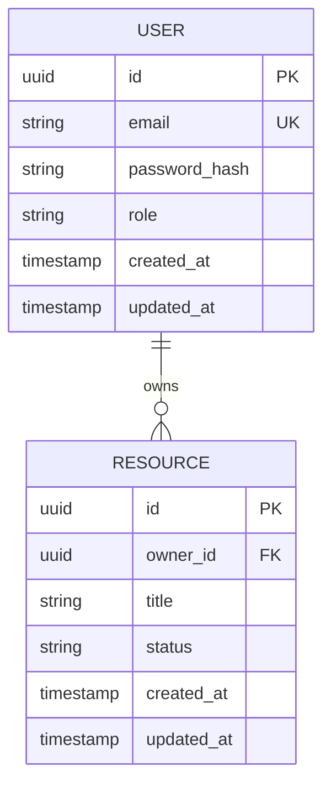

# Data Model: [Product Name]

<!--
PHASE 3 — DATA MODEL
Instructions: Define every entity, its fields, relationships, and constraints.
This document is the authoritative reference for database schema.
All migration files must match this document exactly.

If this document and the actual schema diverge, this document wins — update the schema.
-->

**Version:** 1.0 | **Status:** Draft | **Last Updated:** YYYY-MM-DD  
**Tech Spec Reference:** [docs/spec/technical-spec.md §4](./technical-spec.md)  
**Spec Owner:** [Name]

---

## 1. Entity Relationship Diagram

<!-- Paste your ERD as a Mermaid erDiagram block. It renders natively on GitHub. -->

---

## 2. Entity Definitions

<!--
One subsection per entity. Define every field — no implicit fields.
-->

### 2.1 [Entity: USER]

**Table name:** `users`  
**Description:** Represents an authenticated user of the system.

| Field | Type | Constraints | Default | Description |
|-------|------|-------------|---------|-------------|
| `id` | UUID | PRIMARY KEY | `gen_random_uuid()` | Stable unique identifier |
| `email` | VARCHAR(255) | NOT NULL, UNIQUE | — | User's login email address |
| `password_hash` | TEXT | NOT NULL | — | bcrypt hash of password |
| `role` | ENUM('admin','editor','viewer') | NOT NULL | `'viewer'` | RBAC role |
| `created_at` | TIMESTAMPTZ | NOT NULL | `now()` | Record creation time |
| `updated_at` | TIMESTAMPTZ | NOT NULL | `now()` | Last update time |

**Indexes:**
- `PRIMARY KEY (id)`
- `UNIQUE INDEX ON (email)`

**Business rules:**
- Email must be validated against RFC 5321 format at application layer before insert
- `updated_at` must be updated via trigger or ORM hook on every write

---

### 2.2 [Entity: RESOURCE]

<!-- Repeat pattern for each entity -->

**Table name:** `resources`  
**Description:** [What this entity represents]

| Field | Type | Constraints | Default | Description |
|-------|------|-------------|---------|-------------|
| `id` | UUID | PRIMARY KEY | `gen_random_uuid()` | |
| `owner_id` | UUID | NOT NULL, FK → users.id | — | |
| `title` | VARCHAR(500) | NOT NULL | — | |
| `status` | ENUM('draft','published','archived') | NOT NULL | `'draft'` | |
| `created_at` | TIMESTAMPTZ | NOT NULL | `now()` | |
| `updated_at` | TIMESTAMPTZ | NOT NULL | `now()` | |

**Indexes:**
- `PRIMARY KEY (id)`
- `INDEX ON (owner_id)`

**Business rules:**
- [Rule 1]

---

## 3. Relationship Matrix

| Entity A | Cardinality | Entity B | Foreign Key | Cascade Rule |
|----------|------------|----------|-------------|--------------|
| USER | 1 : Many | RESOURCE | `resources.owner_id → users.id` | ON DELETE RESTRICT |

---

## 4. Enum Definitions

| Enum Name | Values | Used In |
|-----------|--------|---------|
| `user_role` | `admin`, `editor`, `viewer` | `users.role` |
| `resource_status` | `draft`, `published`, `archived` | `resources.status` |

---

## 5. Soft Delete Strategy

<!-- Choose one and document it. Consistency across entities is mandatory. -->

- **Strategy:** [Hard delete / Soft delete with `deleted_at` timestamp / Archive pattern]
- **Applies to:** [List entities]
- **Cascading behaviour:** [Describe what happens to child records]

---

## 6. Migration Strategy

- **Tool:** [e.g., Flyway, Alembic, Prisma Migrate, Rails Migrations]
- **Naming convention:** `V[YYYYMMDD][SEQ]__[description].sql` (e.g., `V20260101001__create_users.sql`)
- **Baseline:** All migrations are applied sequentially; never modify a committed migration file
- **Rollback policy:** [Forward-only / Rollback scripts provided per migration]

---

## 7. Data Validation Rules

<!--
Field-level and cross-entity constraints enforced at the application layer
(in addition to database constraints above).
-->

| Rule ID | Entity | Field(s) | Rule | Error Message |
|---------|--------|----------|------|---------------|
| DV-001 | USER | `email` | Must match RFC 5321 pattern | "Invalid email format" |
| DV-002 | RESOURCE | `title` | Min 3 chars, max 500 chars | "Title must be between 3 and 500 characters" |

---

## 8. Revision History

| Version | Date | Author | Changes |
|---------|------|--------|---------|
| 1.0 | YYYY-MM-DD | [Name] | Initial draft |
